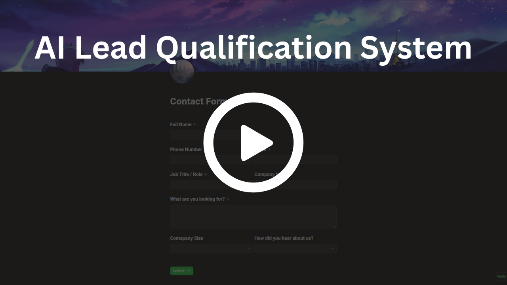
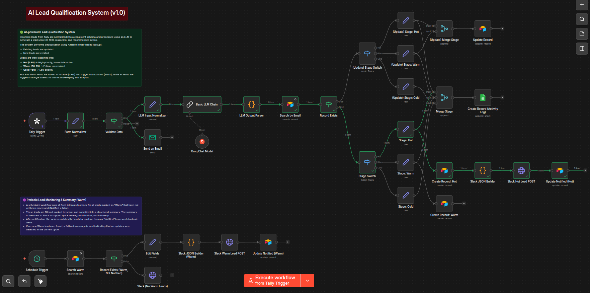
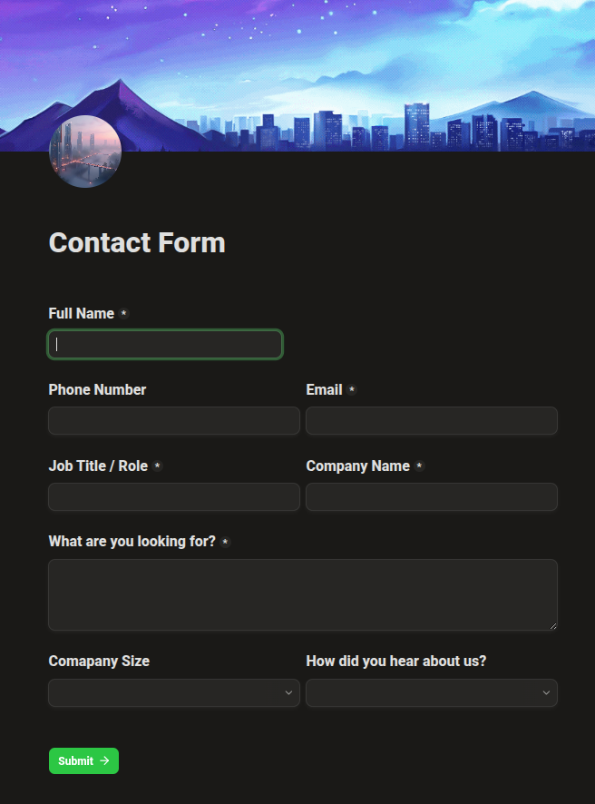
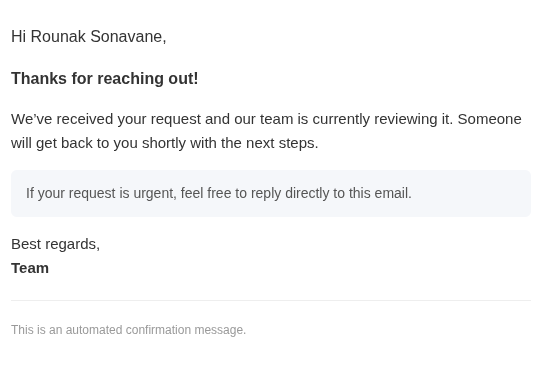
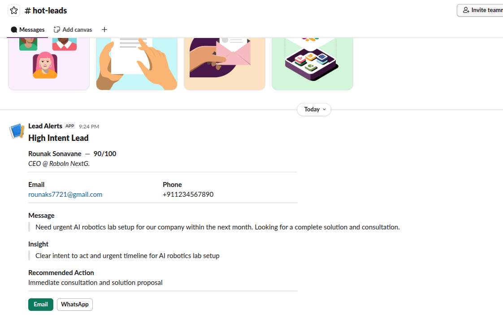
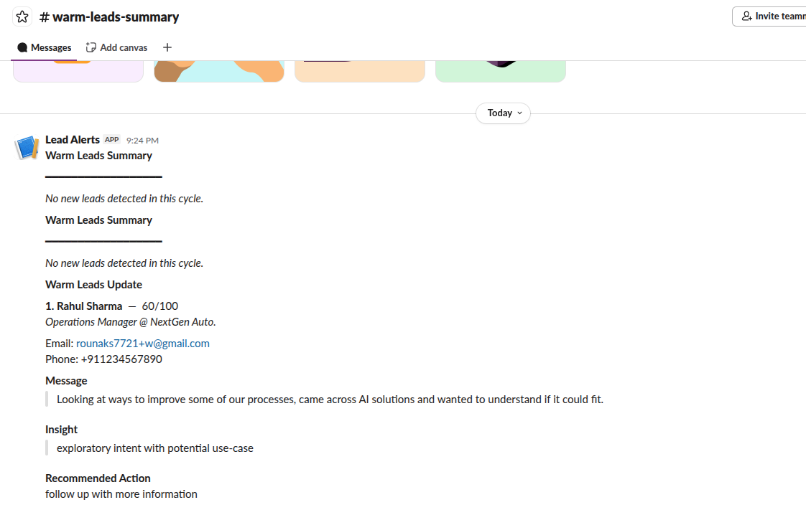
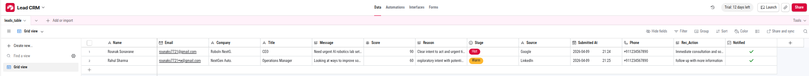
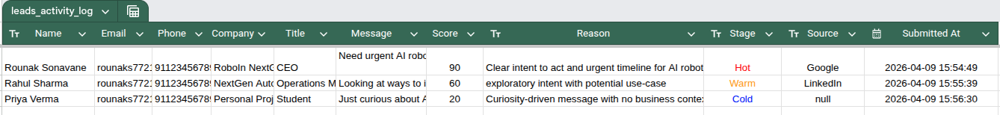

# AI Lead Qualification System

> An end-to-end automated pipeline that captures leads, scores them with an LLM,
> routes them by priority, and notifies your sales team — no manual triage required.


---

## Table of Contents

- [Overview](#overview)
- [Problem](#problem)
- [Solution](#solution)
- [Architecture](#architecture)
- [How It Works](#how-it-works)
- [Key Features](#key-features)
- [Output Previews](#output-previews)
- [Tech Stack](#tech-stack)
- [Project Structure](#project-structure)
- [Getting Started](#getting-started)
- [Warm Lead Monitoring](#warm-lead-monitoring)
- [Data Storage Strategy](#data-storage-strategy)
- [Future Improvements](#future-improvements)
- [License](#license)

---

## Overview

The AI Lead Qualification System is a fully automated pipeline designed to eliminate
manual lead triage. Leads submitted through a web form are scored by an LLM, classified
into priority tiers, stored in a CRM, and routed to the sales team via Slack — all in
real time.

Supports both cloud-based (Groq) and local LLM deployments (Ollama), making it
adaptable for cost-sensitive or air-gapped environments.

---


## Demo

<p align="center">
  <a href="https://drive.google.com/file/d/1wXPjKLh_r1hDt8IFSK952uyqJqzd3I-f/view?usp=sharing">
    
  </a>
</p>

*Click to watch full system demo*

*End-to-end walkthrough: form submission → LLM scoring → CRM update → Slack alerts*

---

## Problem

Manual lead qualification is slow and inconsistent. Sales teams waste time triaging
low-intent submissions while high-priority leads sit unattended. Without a structured
scoring layer, follow-up is delayed and revenue opportunities are lost.

---

## Solution

An AI-driven pipeline that evaluates lead intent using natural language understanding,
assigns a score from 1–100, and routes leads automatically based on priority — with
zero manual intervention.

---

## Architecture
<p align="center">
  
</p>

- **Upper flow** — Real-time lead ingestion, LLM scoring, and routing
- **Lower flow** — Scheduled warm lead monitoring and follow-up
- A `Notified` flag ensures idempotent notifications and prevents duplicate alerts

---

## How It Works

1. Lead submits the intake form → workflow triggers immediately
2. Submitted data is normalized and validated
3. A confirmation email is sent to the lead
4. The LLM scores the lead (1–100) and returns:
   - `score` — numerical priority rating
   - `reasoning` — natural language explanation
   - `recommended_action` — suggested next step
5. Duplicate check is performed via email address
6. Lead is classified and routed:

| Score  | Tier        | Action                              |
|--------|-------------|-------------------------------------|
| ≥ 80   | 🔴 Hot      | Instant Slack alert + CRM entry     |
| 50–79  | 🟡 Warm     | CRM entry + scheduled follow-up     |
| < 50   | 🔵 Cold     | Logged to Google Sheets             |

7. All events are appended to the activity log
8. `Notified` flag is updated to prevent re-alerting

---

## Key Features

- **LLM-based scoring** — Evaluates purchase intent, urgency, and service relevance
- **Real-time + scheduled workflows** — Instant processing with periodic warm lead monitoring
- **Idempotent notifications** — `Notified` flag prevents duplicate Slack alerts
- **Structured Slack alerts** — Actionable messages with score, reasoning, and next steps
- **Email deduplication** — Detects and updates existing records on resubmission
- **Activity logging** — Append-only Google Sheets log for auditing and analytics
- **Robust LLM parsing** — Handles malformed model outputs with fallback logic
- **Local deployment support** — Compatible with Ollama for zero-API-cost operation

---

## Output Previews

### Lead Intake Form
<p align="center">
  
</p>

*User-facing form for capturing lead information.*

---

### Confirmation Email
<p align="center">
  
</p>

*Automated email dispatched immediately after form submission.*

---

### Hot Lead — Slack Notification
<p align="center">
  
</p>

*Real-time alert for high-intent leads with score, insights, and recommended action.*

---

### Warm Lead — Slack Summary
<p align="center">
  
</p>

*Periodic digest of unnotified warm leads, sorted by score.*

---

### CRM — Airtable


*Centralized lead storage with stage and notification tracking.*

---

### Activity Log — Google Sheets


*Append-only interaction log for audit trails and downstream analytics.*

---

## Tech Stack

| Tool                                    | Role                          |
|-----------------------------------------|-------------------------------|
| n8n                                     | Workflow orchestration        |
| LLaMA 3.1 8B (Groq)                     | Lead scoring via LLM          |
| Airtable                                | CRM and lead storage          |
| Google Sheets                           | Append-only activity log      |
| Tally                                   | Lead intake form              |
| Slack                                   | Sales team notifications      |
| SMTP                                    | Confirmation email delivery   |

---

## Project Structure

```
ai-lead-qualification-system/
│
├── README.md
├── docs/
│   └── SYSTEM_DESIGN.md
│
├── assets/
│   ├── system-architecture.png
│   ├── slack-hot.png
│   ├── slack-warm.png
│   ├── airtable.png
│   ├── form.png
│   ├── sheets.png
│   └── confirmation_mail.png
│   └── demo-thumbnail.png
│
├── snippets/
│   ├── llm-prompt.txt
│   ├── parser.js
│   ├── slack-format-hot.js
│   └── slack-format-warm.js
│
├── demo/
│   └── demo.mp4
│
└── LICENSE
```

---

## Getting Started

### Prerequisites

- An active [n8n](https://n8n.io) instance (self-hosted or cloud)
- A Groq API key **or** a local Ollama instance
- Airtable, Google Sheets, Slack, and SMTP credentials

### Environment Variables

Configure the following in your n8n environment or `.env` file:

```env
SLACK_HOT_WEBHOOK=
SLACK_WARM_WEBHOOK=
GROQ_API_KEY=
AIRTABLE_TOKEN=
SMTP_HOST=
SMTP_USER=
SMTP_PASS=
```

> For local LLM deployment, replace the Groq HTTP node with an Ollama request node
> pointing to your local endpoint.

---

## Warm Lead Monitoring

A scheduled workflow runs periodically to catch warm leads that haven't been followed up:

1. Fetches records where `Stage = Warm` and `Notified = false`
2. Sorts leads by score (descending)
3. Sends a structured Slack summary
4. Updates `Notified = true` for all included leads

If no qualifying leads are found, a fallback message confirms the workflow ran successfully.

---

## Data Storage Strategy

| Store          | Purpose                                        |
|----------------|------------------------------------------------|
| Airtable       | Live CRM — current lead state and stage        |
| Google Sheets  | Append-only log — full interaction history     |

This dual-store approach enables full lifecycle tracking, non-destructive auditing,
and analytics-ready exports without polluting the CRM.

---

## Future Improvements

- [ ] Replace polling with event-driven triggers
- [ ] Add retry logic for API/LLM failures
- [ ] Implement LLM fallback model 
- [ ] Lead enrichment via LinkedIn, Clearbit or online sources.
- [ ] Analytics dashboard (scores, conversion rates, tier distribution)
- [ ] Cold lead re-engagement workflow

---

## License

This project is licensed under the [MIT License](LICENSE).